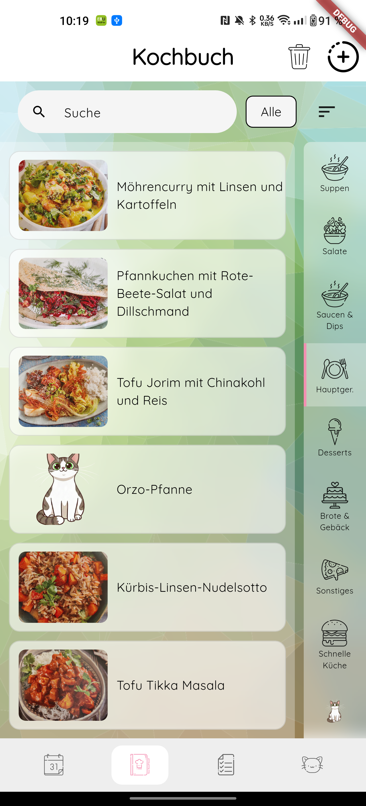
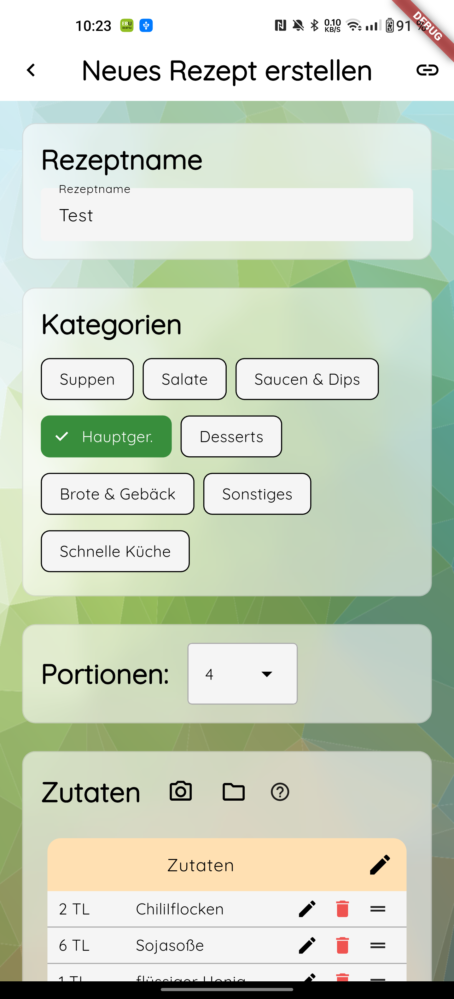
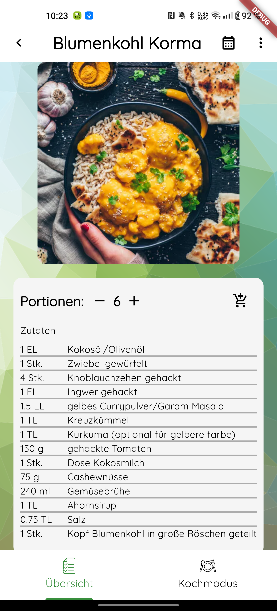

# Meal Planner App

A mobile application for managing and searching recipes – built with Flutter, Supabase, and Firebase.

## Screenshots

<p float="left">
  
  
  
</p>

## Motivation

This project serves as a hands-on learning project to deepen my knowledge in Flutter, mobile app architecture, and backend integration – in preparation for a career as a software developer.

## Features (Current State)

- Create, edit, and manage recipes
- Search and filter recipes
- User authentication
- Image upload for recipes

## Tech Stack

| Area             | Technology                     |
| ---------------- | ------------------------------ |
| Framework        | Flutter (Dart)                 |
| State Management | Riverpod (v2, Code Generation) |
| Database         | Supabase (PostgreSQL)          |
| Auth             | Firebase Authentication        |
| Storage          | Firebase Storage               |

## Architecture

The project follows **Clean Architecture** principles with a clear separation of concerns:

```
lib/
├── core/           # Shared utilities, constants, exceptions
├── domain/         # Entities, repository interfaces (business logic)
├── data/           # Repository implementations, data sources, DTOs
├── services/       # External services (auth, storage)
├── presentation/   # UI layer (pages, providers)
└── widgets/        # Reusable UI components from old state
```

**Data Flow:**

```
UI (presentation/) → Provider → Repository (domain/) → Data Source (data/) → Supabase/Firebase
```

This structure enables:

- Independent testability of each layer
- Swappable backend without UI changes
- Clear separation of business logic and UI

## Tests

The project includes unit tests for critical components:

- `SupabaseRecipeRepository` – repository logic
- `RecipeUploadProvider` – state management
- `SupabaseRecipeRemoteDataSource` – data source integration

```bash
flutter test
```

## Setup

This project requires external configuration files that are not included in the repository for security reasons:

1. **Supabase:** `.env` file with `SUPABASE_URL` and `SUPABASE_ANON_KEY`
2. **Firebase:**
   - Android: `android/app/google-services.json`
   - iOS: `ios/Runner/GoogleService-Info.plist`

```bash
# Install dependencies
flutter pub get

# Run the app
flutter run
```

## Status

🚧 **Work in Progress**

The focus is on clean architecture and correct implementation of core features. Not all features are fully implemented yet.

## Learnings

Through this project, I gained hands-on experience in:

- Building a Flutter app following Clean Architecture
- State management with Riverpod
- Integrating Supabase as a backend
- Firebase Authentication and Storage
- Writing unit tests for repositories and providers
