# Meal Planner App

A mobile application for managing and searching recipes – built with Flutter, Supabase, and Firebase.

## Screenshots

### Light Mode

<p float="left">
  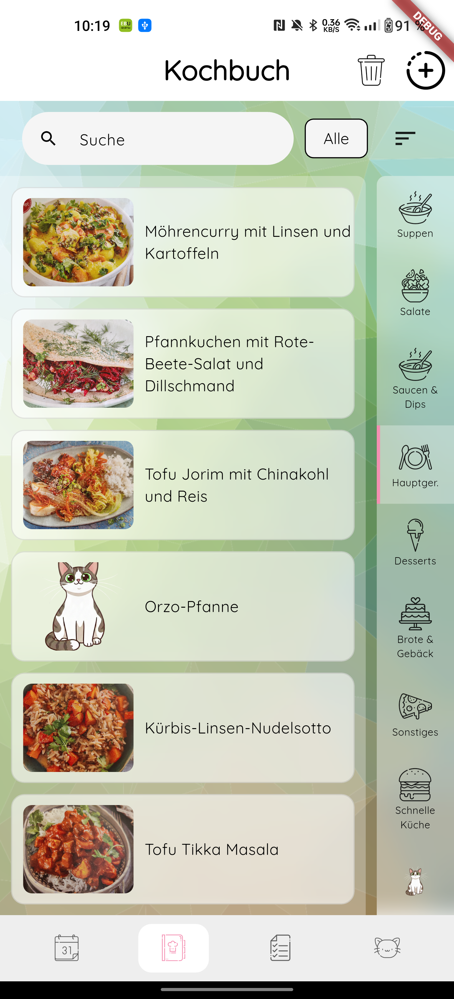
  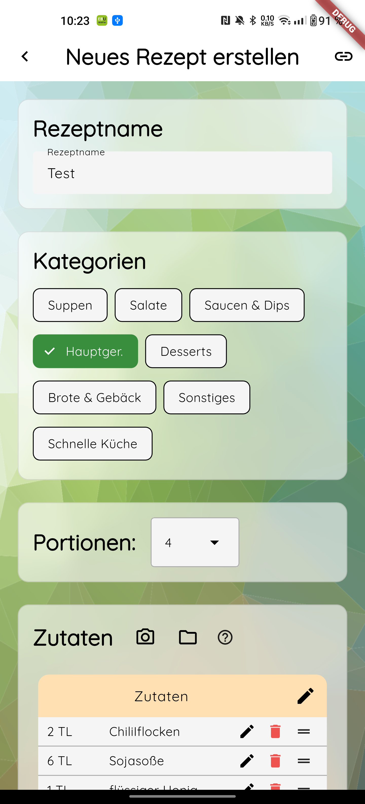
  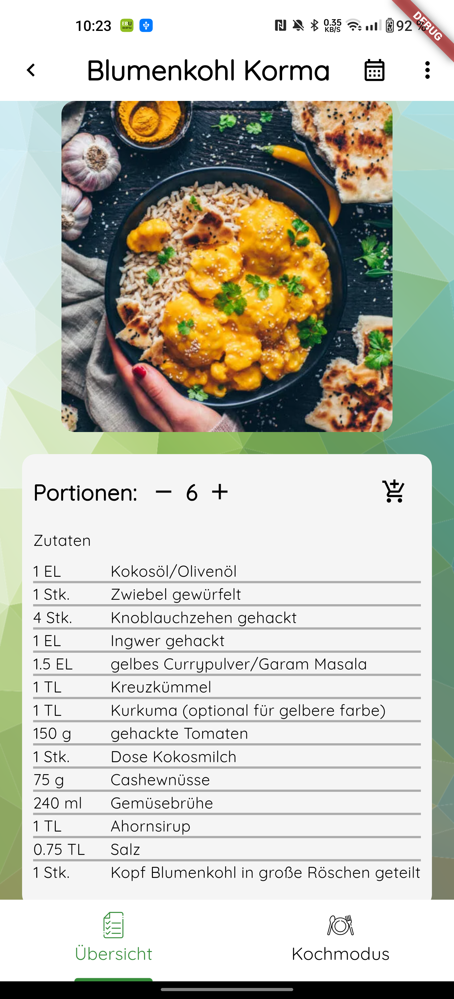
</p>

<p float="left">
  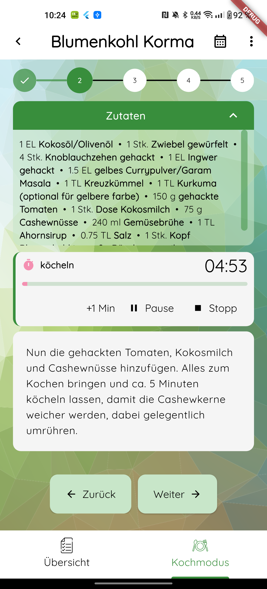
  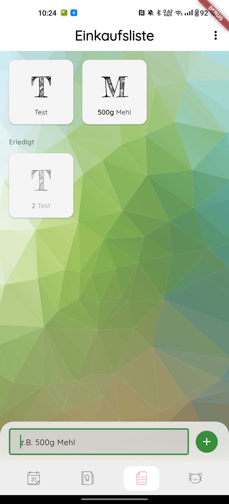
  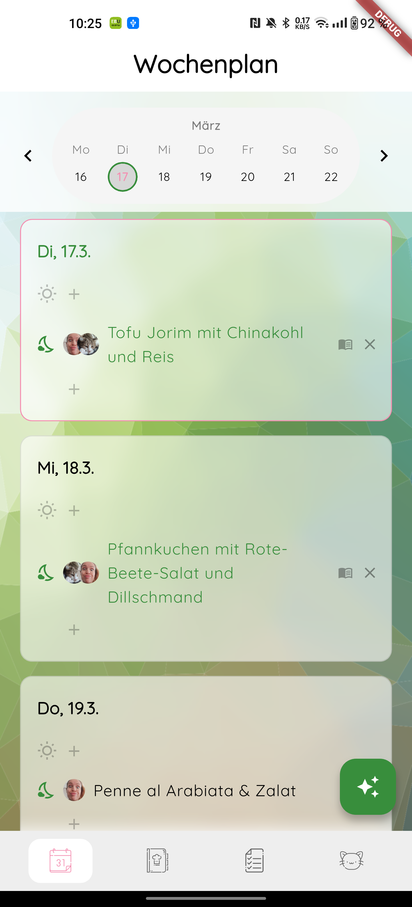
</p>

### Dark Mode

<p float="left">
  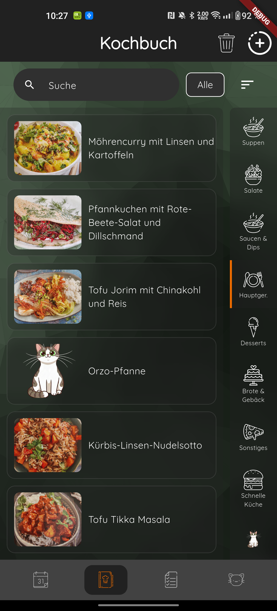
  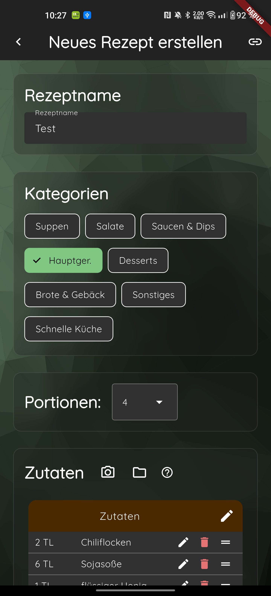
  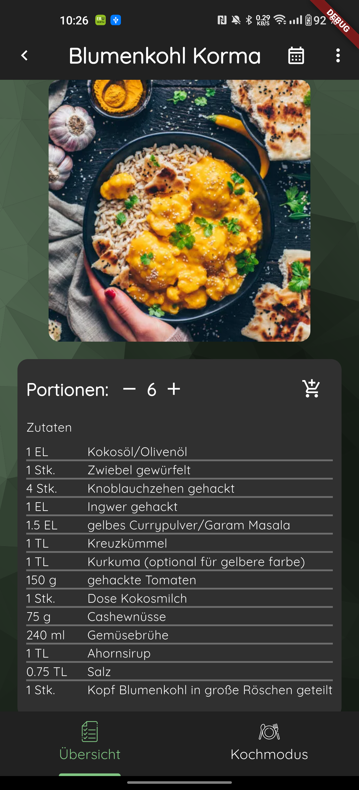
</p>

<p float="left">
  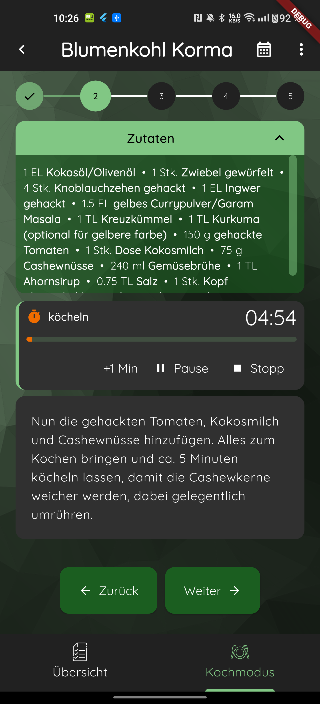
  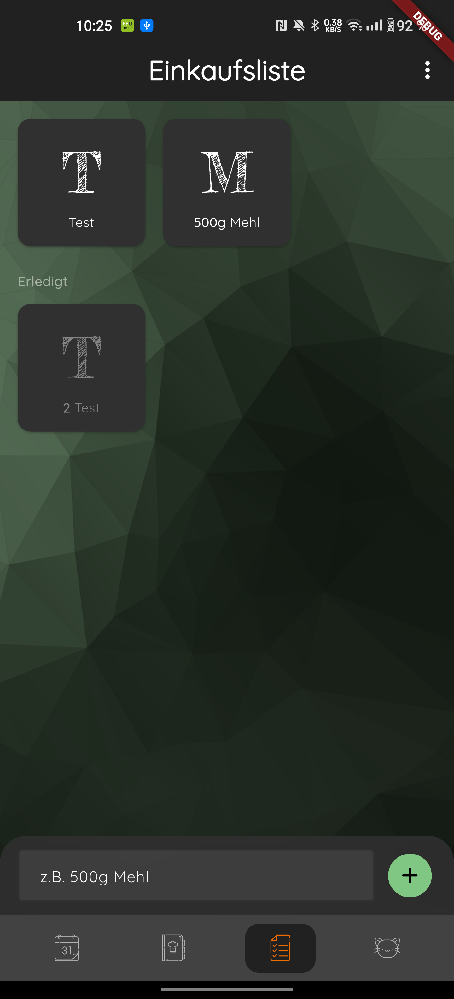
  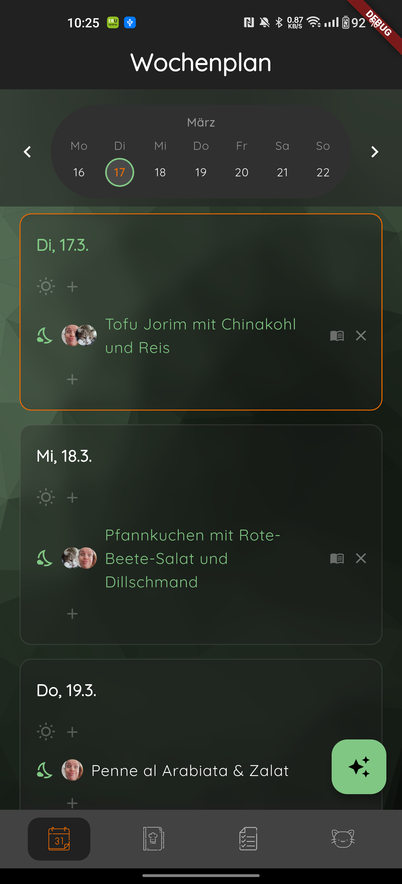
</p>

## Motivation

This project serves as a hands-on learning project to deepen my knowledge in Flutter, mobile app architecture, and backend integration – in preparation for a career as a software developer.

## Features (Current State)

- Weekly meal planner with calendar view and breakfast / lunch / dinner slots
- Intelligent recipe suggestions based on ingredients, rotation, and carb variety
- Create, edit, and manage recipes with custom categories and carb tagging
- Search, filter, and sort recipes (alphabetical, newest, most cooked)
- OCR-powered recipe extraction from images (Google ML Kit)
- Ingredient management with intelligent quantity parsing
- Cooking timers per recipe step with push notifications and background support
- Collaborative shopping list and meal plan with real-time sync (Supabase Realtime)
- Offline-first architecture – local SQLite (Drift) synced to Supabase
- Image upload for recipes (Firebase Storage)
- User authentication and profile management
- Light / Dark / System theme support

## Tech Stack

| Area             | Technology                         |
| ---------------- | ---------------------------------- |
| Framework        | Flutter (Dart)                     |
| State Management | Riverpod (v3, Code Generation)     |
| Database         | Supabase (PostgreSQL + RLS + Realtime) |
| Local Storage    | Drift (SQLite, offline-first)      |
| Auth             | Firebase Authentication            |
| Storage          | Firebase Storage                   |
| Navigation       | AutoRoute                          |
| OCR              | Google ML Kit                      |
| Notifications    | flutter_local_notifications        |
| Preferences      | SharedPreferences (UI preferences) |

## Architecture

The project follows **Clean Architecture** principles with a clear separation of concerns:

```
lib/
├── core/           # Shared utilities, constants, exceptions
├── domain/         # Entities, repository interfaces (business logic)
├── data/           # Repository implementations, data sources, DTOs
├── services/       # External services (auth, storage)
└── presentation/   # UI layer (pages, providers)
```

**Data Flow:**

```
UI (presentation/) → Provider → Repository (domain/) → Data Source (data/) → Supabase/Firebase
```

This structure enables:

- Independent testability of each layer
- Swappable backend without UI changes
- Clear separation of business logic and UI

## Tests

The project includes unit and widget tests for critical components, covering among others:

- `SupabaseRecipeRepository` – repository and data source logic
- `RecipeUploadProvider` – async state management
- Cooking mode widgets – timer interactions and step navigation
- Notification & timer logic – background-safe scheduling and active timer state

```bash
flutter test
```

## Setup

This project requires external configuration files that are not included in the repository for security reasons:

1. **Supabase:** `.env` file with `SUPABASE_URL` and `SUPABASE_ANON_KEY`
2. **Firebase:**
   - Android: `android/app/google-services.json`
   - iOS: `ios/Runner/GoogleService-Info.plist`

```bash
# Install dependencies
flutter pub get

# Generate Riverpod/AutoRoute code
dart run build_runner build --delete-conflicting-outputs

# Run the app
flutter run
```

## Status

🚧 **Active Development**

The focus is on clean architecture and correct implementation of core features.

## Learnings

Through this project, I gained hands-on experience in:

- Building a Flutter app following Clean Architecture
- State management with Riverpod (including provider families, AsyncNotifier, keepAlive)
- Integrating Supabase as a backend with Row Level Security
- Firebase Authentication and Storage
- OCR text processing and intelligent parsing
- Background-safe timer implementation using timestamps
- Writing unit and integration tests for repositories and providers
